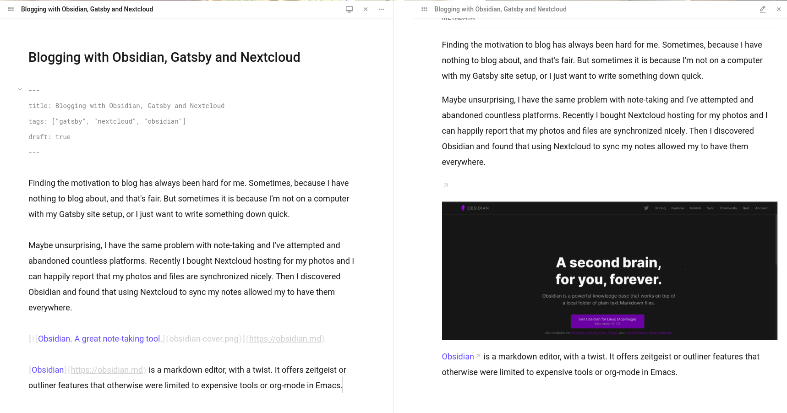
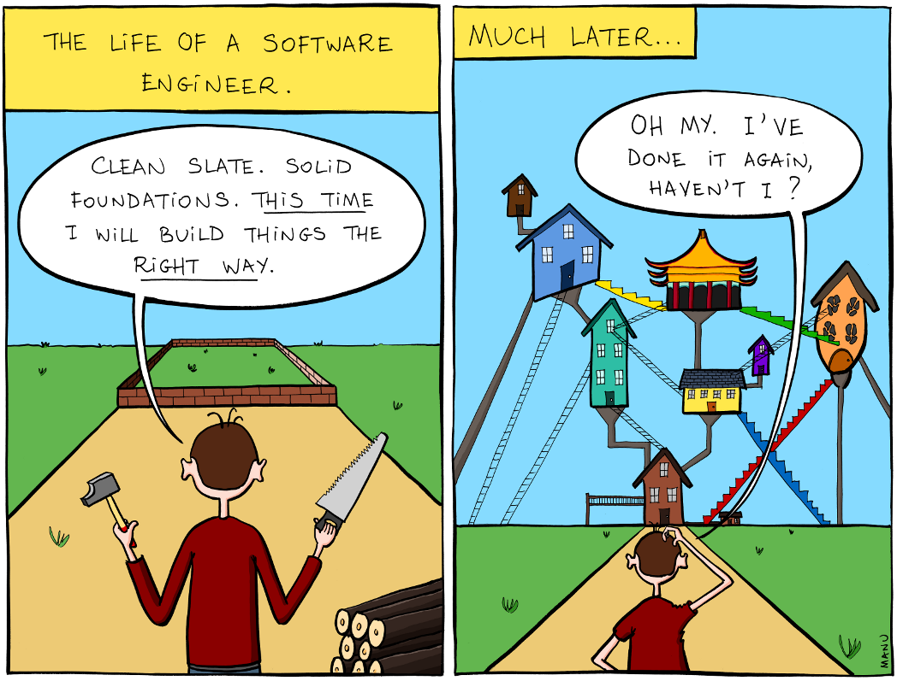
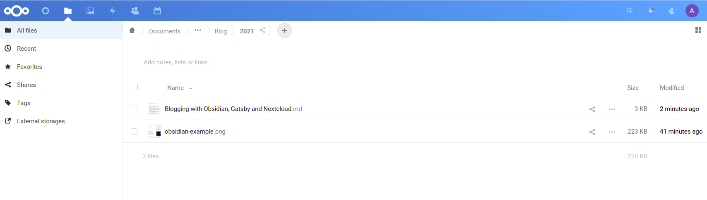
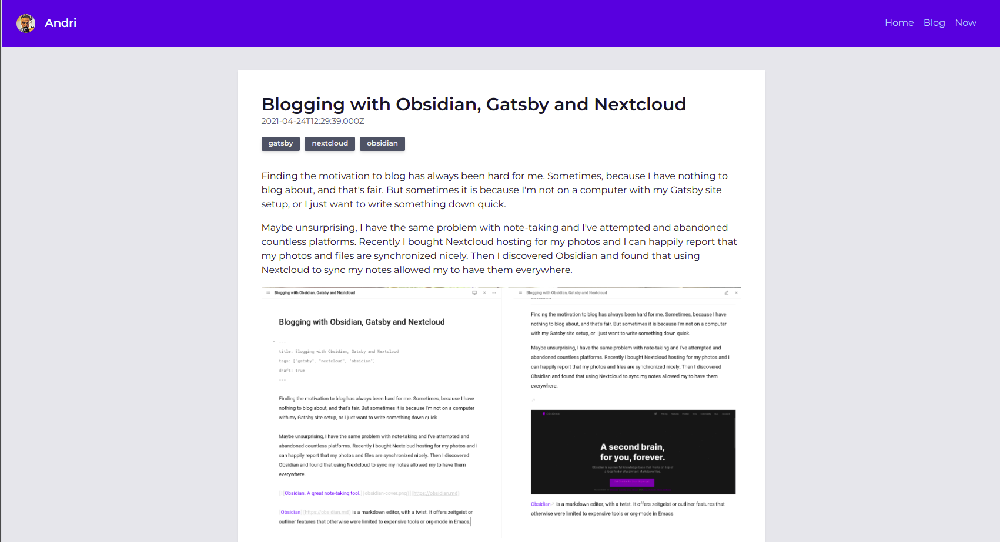

Finding the motivation to blog has always been hard for me. Sometimes, because I have nothing to blog about, and that's fair. But sometimes it is because I'm not on a computer with my Gatsby site setup, or I just want to write something down quick.

Maybe unsurprising, I have the same problem with note-taking and I've attempted and abandoned countless platforms. Recently I bought Nextcloud hosting for my photos and I can happily report that my photos and files are synchronized nicely. Then I discovered Obsidian and found that using Nextcloud to sync my notes allowed my to have them everywhere.



[Obsidian](https://obsidian.md) is a markdown editor, with a twist. It offers zeitgeist or outliner features that otherwise were limited to expensive tools or org-mode in Emacs.

I use it for work, for my daily notes, recipies and now recently, blogging. In case you're curious of the theme, it's [California Coast](https://github.com/mgmeyers/obsidian-california-coast-theme) and a few plugins. Send me a DM if you want the list.

## What I wanted from the workflow

1. Write stuff in Obsidian on **any** of my computers.
3. Add frontmatter tags to my blog-post.
4. Go to bed and have my site automatically updated if there are any new posts.
5. Wake up the next morning and read comments about my blog post.

*If you're thinking...*



Then you're absolutely right. But if you can't overengineer your personal projects, then there is something wrong with the world. [Image credit](https://bonkersworld.net/building-software).

## Before we get started
You can skip this if you don't plan on repeating my experiment.

I must add that this isn't exactly *production ready*, since I had to modify some plugins to make this work. Proceed at your own risk.

- [Install](https://nextcloud.com/install/#instructions-server) or [sign up](https://nextcloud.com/signup/) for Nextcloud
- Install [Nextcloud client](https://nextcloud.com/clients/)
- Install [Obsidian](https://obsidian.md)
- [Setup a new Gatsby site](https://www.gatsbyjs.com/get-started/) or use an existing one.

## Setting up your vault

I have a one big vault in Obsidian and source my blog posts from `blog/`. So anything in there will get picked up by Gatsby (more on that later). Nextcloud will sync your files across all of your computers.

Writing Markdown is easy, but if you want to know more, I recommend Github's [Mastering Markdown](https://guides.github.com/features/mastering-markdown/).

Obsidian also supports drag-and-drop on images, so I just drop them into my editor and Obsidian copies the files.

> **Note:** By default, Obsidian puts them in the root of your vault. I have "Files & Links > Default Location for New Attachments" set to "Same folder as current file". Also be sure to set "Use \[\[Wikilinks\]\]" to "false".

## Writing blog posts

At this point you have Obsidian setup and Nextcloud syncing your files to a server. Create a new file in `blog/2021/testing.md` and add some frontmatter data to it.

	```md
	---
	title: Overriding blog title
	tags: ["gatsby", "nextcloud", "obsidian"]
	---
	
	## I am a test blog post
	
	Fear my grammar skills!
	
	```
    

## Syncing to Nextcloud

After you've created your first blog-post, check your Nextcloud instance to verify the changes were synced.



I use a seperate user that only has read-access to my blog directory for security reasons, but to keep things simple; I'm going to skip that part.

## Enter the Great Gatsby

### Installing the plugins
You need to install the following plugins for this to work.

- [@andrioid/gatsby-source-webdav](https://github.com/andrioid/gatsby-source-webdav): Allows us to fetch Gatsby nodes from webdav. This is basically [this](https://github.com/dmgarland/gatsby-source-webdav) with a newer version of webdav and support for remark nodes. I tried getting a PR merged, but received no response. I'd be happy to try again if the author wishes me to.
- [gatsby-remark-webdav](https://github.com/andrioid/andri.dk/tree/master/plugins/gatsby-remark-webdav): Something i hacked together. Not ready to release on NPM yet. Only use this if you need image assets from webdav. It parses your markdown posts from webdav and searches for images. If then copies the images and makes relative links work during the build process.

```
npm install --save @andrioid/gatsby-source-webdav
```

You can copy the other plugin into your `plugins/` directory if you want to use it. I may release it on NPM later.

### Configuring the plugins

**gatsby-config.js** (in your plugins section)
```js
[
  {
    resolve: "@andrioid/gatsby-source-webdav"
      options: {
        baseURL: `https://${process.env["BLOGDATA_BASEURL"]}/remote.php/dav/files/${process.env["BLOGDATA_USER"]}`,
        credentials: {
          username: process.env["BLOGDATA_USER]",
          password: process.env["BLOGDATA_PASSWORD"], // Please don't hardcode this
		},
		recursive: true,
		glob: "**/*.{md,jpg,jpeg,png,gif}",
		sharePath: "Documents/MyVault/Blog", // yours will vary
      },
    },
    {
      resolve: "gatsby-transformer-remark",
      options: {
        plugins: [
          "gatsby-remark-webdav", // if you use it
		  "gatsby-remark-images"
        ],
      },
    },
]
```

When you start your Gatsby dev-server, make sure to add the ENV variables you just configured, like so: 

```
BLOGDATA_BASEURL=https://mynextcloud.example.com \
BLOGDATA_USER=myuser \
BLOGDATA_PASSWORD=secret \
npm start
```

Gatsby will now connect to your Nextcloud server and process all the files listed in `sharePath`



## Node Creation

What `gatsby-source-webdav` does, is creating Gatsby file nodes for the files it finds on the webdav endpoint. Then `gatsby-transform-remark` reacts to those file-nodes and creates markdown nodes.

If you're using my `gatsby-remark-webdav` plugin, then it reacts to webdav backed Markdown nodes and then copies the files necessary to link image

Those markdown nodes are then used to generate our blog posts or other markdown powered pages (and we won't be covering that).

Every Gatsby site is a bit different in how it creates pages, but I like to add node fields so that my GraphQL queries on pages are as simple as possible.

Here is my `onCreateNode` handler, yours may differ. What is happening here, is that some of my content is sourced from files, but some of it is sourced from webdav. To unify the node-fields, I use frontmatter where I can, but otherwise I try to use sensible defaults (like filename on webdav).

> **Note:** Please don't copy this blindly. There are some things (such as the slug generation) that should be rewritten when I wrote this blog post. Hopefully I already did that at the time you read this.

**gatsby-node.js**
```js
exports.onCreateNode = ({ node, getNode, actions, reporter }) => {
  const isDev = process.env.NODE_ENV !== "production";
  const { createNodeField } = actions;
  if (node.internal.type === `MarkdownRemark`) {
    if (!node.parent) {
      return;
    }
    const fileNode = getNode(node.parent);

    const { frontmatter } = node;
    let title = frontmatter.title;
    let slug = frontmatter && frontmatter.path;
    let date = frontmatter && frontmatter.date && new Date(frontmatter.date);
    let tags = (frontmatter && frontmatter.tags) || [];
    let draft = (frontmatter.draft === true && !isDev) || false;

    if (fileNode.parent) {
      const davNode = getNode(fileNode.parent);
      if (davNode && davNode.internal.type === "webdav") {
        const namePath = path.parse(davNode.filename);
        if (!title) {
          title = namePath.name;
        }
        if (!slug) {
          slug = `${namePath.dir}/${namePath.name}`.toLowerCase();
        }
        if (!date) {
          date = new Date(davNode.lastmod);
        }
      }
    }

    if (!slug) {
      console.error("no slug", node);
      //reporter.panic("No slug found for markdown node");
    }

    createNodeField({
      node,
      name: `title`,
      value: title,
    });

    createNodeField({
      node,
      name: `slug`,
      value: slug,
    });

    createNodeField({
      node,
      name: `date`,
      value: date,
    });

    createNodeField({
      node,
      name: `tags`,
      value: tags,
    });

    createNodeField({
      node,
      name: `draft`,
      value: draft,
    });
  }
};

```

## Automating the process

I did mention that I don't want to think about publishing. The only thing I need to change to publish my blog-posts is to set `draft: false` in my frontmatter and it should just deploy.

What I really wanted to do, was to get Nextcloud to notify DigitalOcean (where I host my blog) and initiate a deployment from there. But, I couldn't get Nextcloud's Flow to work. If you know how to do it, [please let me know](https://twitter.com/andrioid).

### Plan B
I settled on a less complicated solution. I use Github Actions to deploy my site every night.

> Update. Github didn't like that much and changed how cron works for Github Actions..

You need to add `DIGITALOCEAN_ACCESS_TOKEN` and `DIGITALOCEAN_APP_ID` to your project's secrets. To create the acceess-token, follow [these instructions](https://docs.digitalocean.com/reference/api/create-personal-access-token/).

**.github/workflows/daily-deploy.yml**
```yml
name: Daily Deploy
on:
  schedule:
    - cron: "0 3 * * *"
jobs:
  build:
    runs-on: ubuntu-latest
    steps:
      - name: Install doctl
        uses: digitalocean/action-doctl@v2
        with:
          token: ${{ secrets.DIGITALOCEAN_ACCESS_TOKEN }}
      # Force is used because we fetch from webdav
      - run: doctl apps create deployment ${{ secrets.DIGITALOCEAN_APP_ID }} --wait --force-rebuild

```

While I use DigitalOcean's App platform, there is nothing preventing this from working on other great hosting providers like Netlify or Vercel. But because we're sourcing our blog-posts from webdav, these Git based integrations have no way of knowing that our site now has new data.

Remember to add your Nextcloud credentials to whatever build-platform you're using. Otherwise you're not going to get any data from the webdav server.

## Room for improvement

### Slug generation
I really wanted to get this out there, so I haven't made the slug generation as pretty as I'd like.

### Mermaid
Obsidian supports [Mermaid](https://mermaid-js.github.io/mermaid/#/) diagrams, and I want my Gatsby site to render those as well. I tried using `gatsby-remark-mermaid`, but it didn't work with DigitalOcean's buildpacks due to a missing Chrome(ium) installation. That's one heck of a dependency, if you ask me.

I'll look into it later.

### `gatsby-remark-webdav`
As I noted earlier, I just threw something together that works for me and if I find the time and motivation; I'd like to release it. Until then, grab it from [here](https://github.com/andrioid/andri.dk/tree/master/plugins/gatsby-remark-webdav) if you need it.


## What's missing?
It's hard to compress my entire website into one article. I hope I covered what you need to set up something similar with your Gatsby site.

My [site's source-code](https://github.com/andrioid/andri.dk) is on Github, so feel free to poke around there if something isn't working.

Let me know via [DM](https://twitter.com/andrioid) if you think I should add something to this article.

Oh, and in case you were wondering. This blog post was written in Obsidian and automatically deployed.