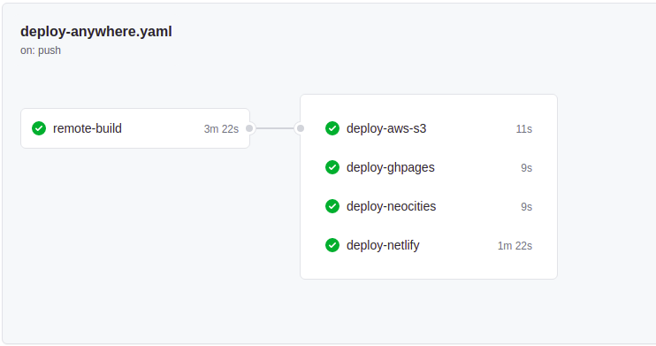
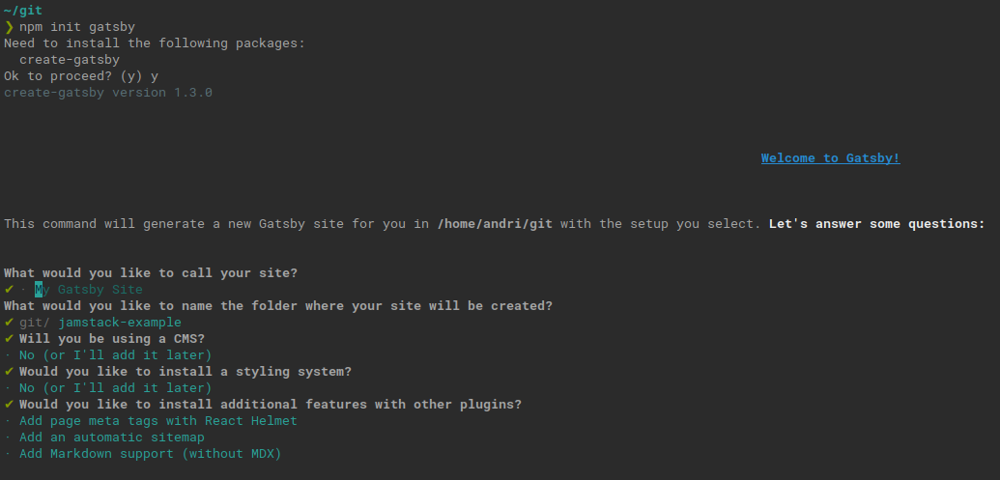
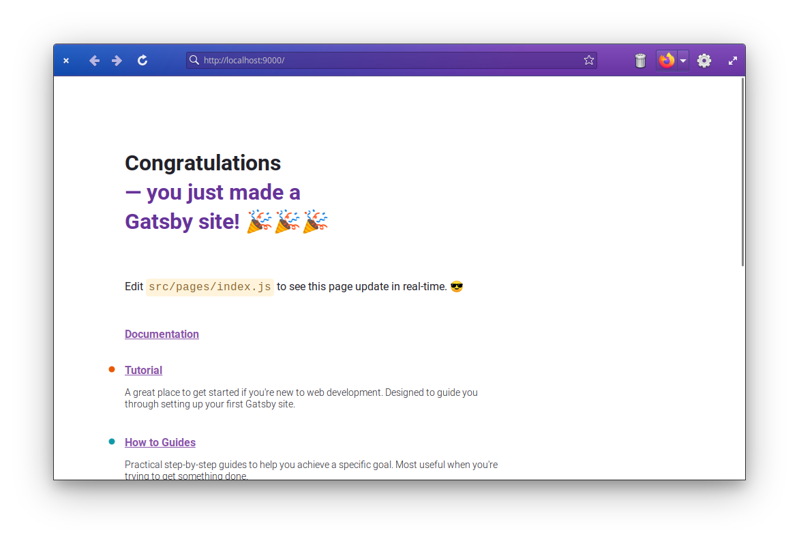
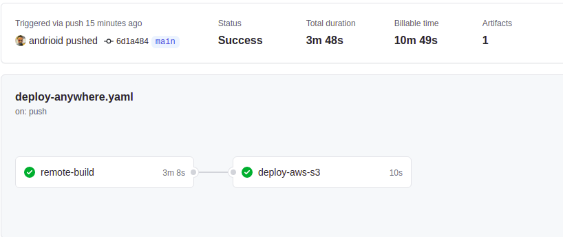
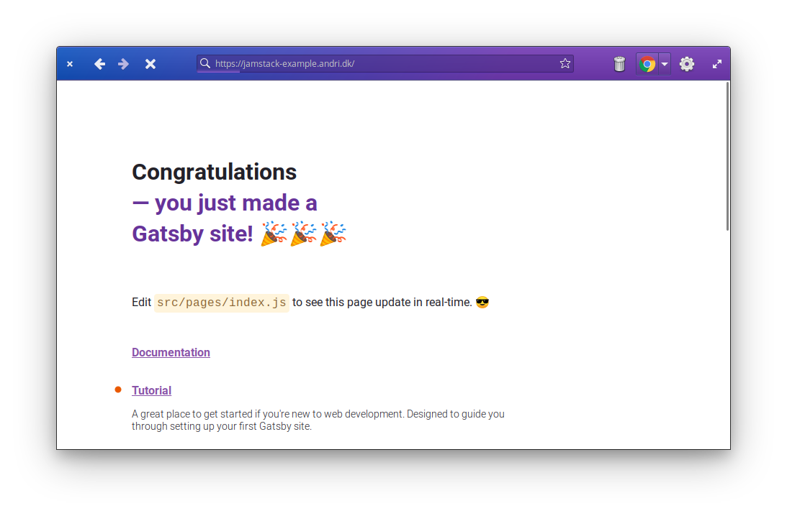
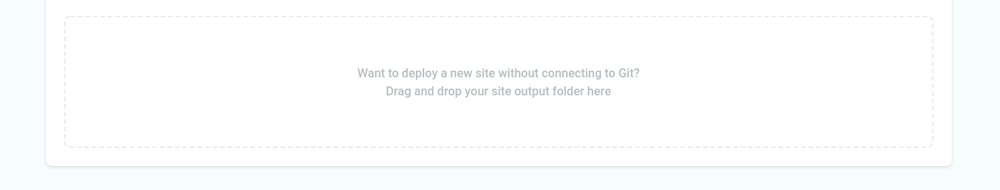
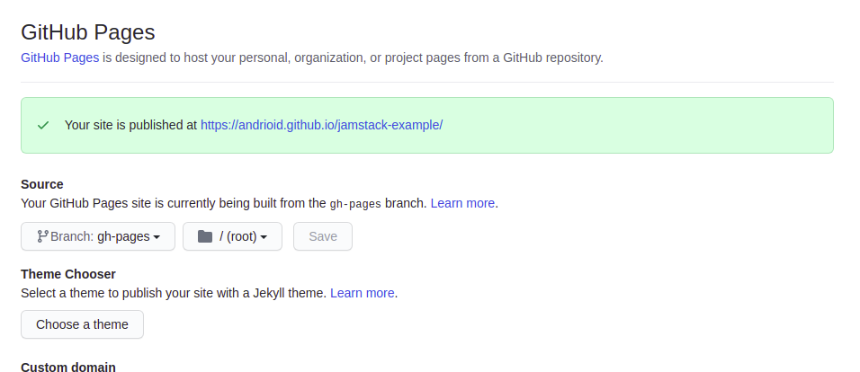

Before I started my carrier in Software Development, I was a System- and Network Administrator. I used to setup web servers and managed my own little server room. I truly, do not miss upgrading operating-systems on live services or dealing with hardware failure. However, hosting web-pages back then was much easier. You'd get an FTP/SFTP access and you'd upload your files. Then they got served statically...

Today, everything is about **scale** and maybe prematurely so. If you want to host a typical static site today, many hosting providers force you to add a Github (or similar) integration to your repository. To be fair; these providers offer automatic TLS, CDN, fail over and full scaling. But, what if I want to upload my own files? What if I already have a build-pipeline somewhere? Then this forced build-process is not convenient, but quite **annoying**.

I'm going to show you how to break free and deploy your static site wherever you want, using nothing but Github Actions.



## Our toolbox for today

- **[Github Actions](https://docs.github.com/en/actions)**: Github's build pipeline. This can be done on any CI platform. I simply chose Github actions because almost everyone uses Github and it's free for open source projects.
- **[rclone](https://rclone.org)**: A wonderful file-syncing tool that supports a whole range of services.
- **[Buildpacks](https://buildpacks.io)**: Build almost any project without writing a single Dockerfile. It detects your project, handles caching and has been used in production at Heroku for a very long time.

You also need [node.js](https://nodejs.org) and [git](https://github.com/git-guides/install-git) installed before we proceed. This guide expects that you know how to work with Git and Github.

## TLDR;
If you're anything like me, you just want to skip the bullshit and [dive straight into the code](https://github.com/andrioid/jamstack-example).

## Setting up our sample Gatsby site
This could be any type of static site. I decided to go with Gatsby, because that's what I'm using. The only thing we assume here, is that `npm run build` works and builds to `public/`. Otherwise you have to adjust for it yourself.

> **Note**: If you already have a site you want to deploy, you can skip this part.

```shell
npm init gatsby
# follow the prompts
```


> **Note**: If you enabled the feed or sitemap plugins you need to add a `metadata.siteUrl` to your `gatsby-config.js`.

```bash
cd jamstack-example # or whatever you named yours
npm run develop # if you want to play with it
npm run build
```


Now you have a site in `public/` that is ready to be deployed. Let's try it out real quick before going on to the Github part.

```bash
npm run serve
```

Then direct your browser to [http://localhost:9000](http://localhost:9000). If everything went well, you should see this.



## Building it with Actions

Log on to Github and create a new repo. On that repo, find the repository URL and copy it where it says `<repo>`.

```bash
git remote add origin <repo>
git branch -M main
git push -u origin main

```

Now then. Let's add some actions! Create a file with this name and add it to your project. 

#### **.github/workflows/deploy-anywhere.yml**
```yaml
name: buildpack
on: [push, pull_request]
jobs:
  remote-build:
    runs-on: ubuntu-latest
    container:
      image: docker:stable
      volumes:
        - /home/runner:/workspace
    env:
      IMG_NAME: ${{ github.workflow }}
      NODE_ENV: production # Makes this a little more clean on the Node side
    steps:
      - name: Checkout
        uses: actions/checkout@v2
      - name: Login to GitHub Container Registry
        uses: docker/login-action@v1
        with:
          registry: ghcr.io
          username: ${{ github.repository_owner }}
          password: ${{ secrets.GITHUB_TOKEN }}

      # Downloads and caches the pack command (the code is open)
      - uses: andrioid/setup-pack@main
      # Attempt to fetch any previous image so that we may use it for caching
      - run: docker pull ghcr.io/${GITHUB_REPOSITORY}/${IMG_NAME} || true
      # Builds your site with buildpacks (heroku builder)
      - run: pack build ghcr.io/${GITHUB_REPOSITORY}/${IMG_NAME} --builder=heroku/buildpacks:20
      # Pushes your new image to Github's Container Registry
      - run: docker push ghcr.io/${GITHUB_REPOSITORY}/${IMG_NAME}
      # Copy the build assets from the container and cleanup
      - run: CONTAINER_ID=$(docker create ghcr.io/${GITHUB_REPOSITORY}/${IMG_NAME}:latest /bin/sh) && docker cp ${CONTAINER_ID}:/workspace/public . && docker rm ${CONTAINER_ID}
      - run: ls -alh public
      - uses: actions/upload-artifact@v2
        with:
          name: public
          path: public/


```

It goes without saying that you need to add, commit and push this change afterwards.

## Deployment

- [Deploy to AWS S3](#deploy-to-aws-s3)
- [Deploy to Github Pages](#deploy-to-github-pages)
- [Deploy to Neocities](#deploy-to-neocities)
- [Deploy to Netlify](#deploy-to-netlify)
- [Deploy to SFTP](#deploy-to-sftp)

### Deploy to AWS S3
Amazon's S3 is one of the oldest managed cloud service and it shows why. It's capable to act as a bin for all your files, yet also supports things like static hosting and rewrites.

#### Create a bucket
Log on to AWS management console and find the S3 page. Create a bucket and note the ARN name.

#### IAM & access control
One of the most painful AWS experiences, is how we deal with permissions. I've done this many times, but I have to look it up every time.

Create a user with IAM and assign the following permissions with a new policy. Replace \<MYBUCKET\> with your ARN from earlier. Mine is *"arn:aws:s3:::jamstack-example.andri.dk/"*.

#### **jamstack-policy**
```
{
    "Version": "2012-10-17",
    "Statement": [
        {
            "Sid": "VisualEditor0",
            "Effect": "Allow",
            "Action": [
                "s3:PutObject",
                "s3:GetObject",
                "s3:ListBucket",
                "s3:DeleteObject",
                "s3:PutObjectAcl"
            ],
            "Resource": [
                "<MYBUCKET>",
                "<MYBUCKET>/*"
            ]
        }
    ]
}
```

This policy allows your user to upload, download, list files, delete objects and upload with permissions (rclone uses this to apply your acl). The resources limit this permission to this single bucket (a good idea!).

#### TLS / SSL
Some services do this automatically, but AWS requires you to do this manually. I didn't add TLS to my example site, but you can take a look at this [this blog post](https://towardsdatascience.com/static-hosting-with-ssl-on-s3-a4b66fb7cd00?gi=2d84a6cc94b4) on how to add TLS to your S3 hosted site.


#### All done!

The site is now deployed on AWS S3.



Doing with any S3/SFTP any site isn't much different from the S3 example. In the appendix, I'll provide a few more examples.

```yaml
  deploy-aws-s3:
    needs: remote-build
    runs-on: ubuntu-latest
    env:
      RCLONE_CONFIG_AWSS3_TYPE: s3
      RCLONE_CONFIG_AWSS3_ACCESS_KEY_ID: ${{ secrets.S3_KEY_ID }}
      RCLONE_CONFIG_AWSS3_SECRET_ACCESS_KEY: ${{ secrets.S3_SECRET_ACCESS_KEY }}
      RCLONE_CONFIG_AWSS3_REGION: eu-central-1 # yours may differ
      RCLONE_CONFIG_AWSS3_ACL: "public-read"
      BUCKETNAME: jamstack-example.andri.dk
    steps:
      - uses: andrioid/setup-rclone-action@main
      - uses: actions/download-artifact@v2
        with:
          name: public
          path: public
      - run: ls -alh
      - run: rclone ls awss3:${BUCKETNAME}
      - run: rclone -v copy public awss3:${BUCKETNAME}
```
This is how my deploy-aws-s3 job looks in my workflow file.

You can see the site in action [here](http://jamstack-example.andri.dk/).

### Deploy to Netlify
To be able to upload files to Netlify, you have to create a new site. To create a site without adding a Git repo, you can go to the "Sites" page and in the bottom there is a drag-drop area where you can drop your "public" directory to create a new site.



When that is done, you can use the following job definition. Just grab the *Site API ID* from the site-settings page.

```yaml
  deploy-netlify:
    needs: remote-build
    runs-on: ubuntu-latest
    steps:
      - uses: actions/download-artifact@v2
        with:
          name: public
          path: public
      - uses: jsmrcaga/action-netlify-deploy@v1.1.0
        with:
          NETLIFY_AUTH_TOKEN: ${{ secrets.NETLIFY_TOKEN }}
          NETLIFY_DEPLOY_TO_PROD: true
          NETLIFY_SITE_ID: ${{ secrets.NETLIFY_SITE_ID }}
          BUILD_DIRECTORY: public
```

You can see the site in action [here](https://jamstack-example-andri.netlify.app).

### Deploy to Github Pages

Github Pages uses Git, and if you have a project that you want to use for Github Pages you can just create an empty "gh-pages" branch and use it to update your site.

For this blog-post, I created "andrioid/jamstack-example" and I'm using that for a demo deployment.

To setup our pages branch, do the following. [Credit](https://stackoverflow.com/a/34100189/99209).
```session
git checkout --orphan gh-pages
git rm -rf .
git commit --allow-empty -m "root commit"
git push -u origin gh-pages

```

This creates a branch named "gh-pages" without any commit history. Then deletes all of the tracked files. Then we add an empty commit and push it. Github will automatically set Pages up when the branch is named "gh-pages".



The only remaining thing is to use our build-step to upload the site to this branch. Fortunately there is [an action](https://github.com/JamesIves/github-pages-deploy-action) that does just that.

```yaml
  deploy-ghpages:
    needs: remote-build
    runs-on: ubuntu-latest
    steps:
      - name: Checkout
        uses: actions/checkout@v2 # needed to setup git
      - uses: actions/download-artifact@v2
        with:
          name: public
          path: public
      - uses: JamesIves/github-pages-deploy-action@4.1.1
        with:
          branch: gh-pages
          folder: public
```

Add this job to **your deploy-anywhere.yaml** file.

You can see the site in action [here](https://andrioid.github.io/jamstack-example).

### Deploy to Neocities
Neocities offers free hosting and if you upgrade you can have TLS and a custom domain as well. They also support Webdav and that would allow us to upload with rclone (just like we did with S3), but I don't have a premium account.

So, to get this running we grab the [Deploy to Neocities action](https://github.com/marketplace/actions/deploy-to-neocities). You can find your API key in the Neocities Site Settings. Add it to your repo secrets as "NEOCITIES_API_KEY".

```yaml
  deploy-neocities:
    needs: remote-build
    runs-on: ubuntu-latest
    steps:
      - uses: actions/download-artifact@v2
        with:
          name: public
          path: public
      - name: Deploy to neocities
        uses: bcomnes/deploy-to-neocities@v1
        with:
          api_token: ${{ secrets.NEOCITIES_API_KEY }}
          cleanup: false
          dist_dir: public
```

Add this job to **your deploy-anywhere.yaml** file.

You can see the site in action [here](https://jamstack-example.neocities.org/).

### Deploy to SFTP
I setup a small webserver with automatic TLS on DigitalOcean to demonstrate SFTP. You can read about it [here](https://andri.dk/blog/2021/host-static-websites-on-a-vps).

You need the following secrets set up on your repo:

-   **SFTP_HOST**: host or ip of sftp server
-   **SFTP_USER**: webuser
-   **SFTP_PASS**: yourverysecretpassword

Add this job to your **deploy-anywhere.yaml** file.

```yaml
  deploy-via-sftp:
    needs: remote-build
    runs-on: ubuntu-latest
    env:
      RCLONE_CONFIG_VPS_TYPE: sftp
      RCLONE_CONFIG_VPS_HOST: ${{ secrets.SFTP_HOST }}
      RCLONE_CONFIG_VPS_USER: ${{ secrets.SFTP_USER }}
      RCLONE_CONFIG_VPS_PASS_PLAIN: ${{ secrets.SFTP_PASS }}
    steps:
      - uses: andrioid/setup-rclone-action@main
      - uses: actions/download-artifact@v2
        with:
          name: public
          path: public
      - run: echo "RCLONE_CONFIG_VPS_PASS=$(rclone obscure ${RCLONE_CONFIG_VPS_PASS_PLAIN})" >> $GITHUB_ENV
      - run: rclone -v copy public vps:.
```

You can see the site in action [here](https://hostingdemo.andri.dk). This link may stop working when I decide that I don't want to pay $5/mo for it.

### Additional Hosting Providers?

Please drop me a line on [Twitter](https://twitter.com/andrioid) if you want to add a hosting provider to this post. The only requirement is that it's possible to create the project without Git integration.

#### Deploy to Vercel 🚫️

Before Vercel was Zeit, their CLI `now` was able to take any folder and make it a website. But, it doesn't look like Vercel allows any of that anymore. I also can't find a way to create a project without integrating with a Git hosting provider.

#### Deploy to DigitalOcean 🚫️
DigitalOcean Spaces was actually my first attempt, but only after getting almost everything working, I realized that [they don't support indexes](https://www.digitalocean.com/community/questions/spaces-set-index-html-as-default-landing-page). So, I had everything up and running with their CDN, but I had to manually link to "index.html".

As far as I know, there is no way of manually uploading files to their "Static Apps" offering.


## Final words
When I started writing this post, I was sure that most of the hosting providers _did_ in fact support open standards like SFTP, Webdav or even S3. But, that's not the case and that makes me sad.

Why those providers have the need to dominate our workflows is beyond my understanding. After all, what we're uploading here isn't any different than classic websites. All we need is a web-server. Everything else is just gravy.

## Appendix

### How to copy files from a Docker image

```session
docker create $image  # returns container ID
docker cp $container_id:$source_path $destination_path
docker rm $container_id
```

