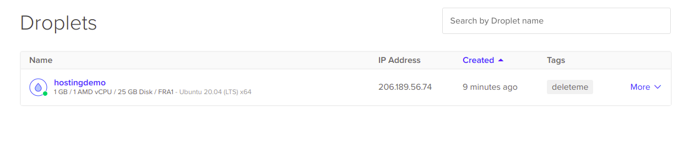
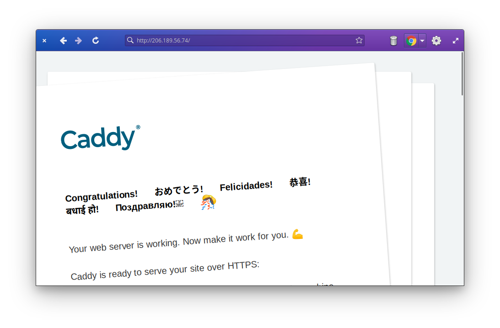
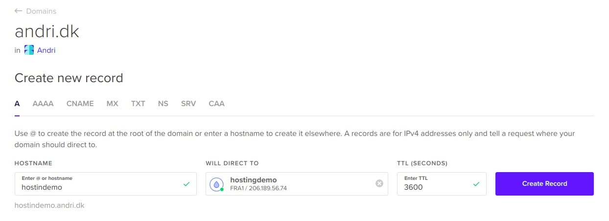
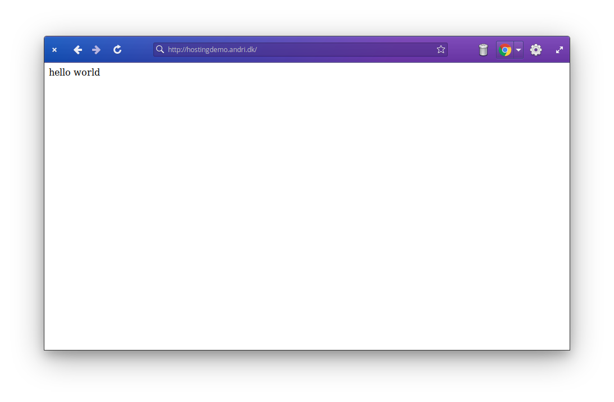
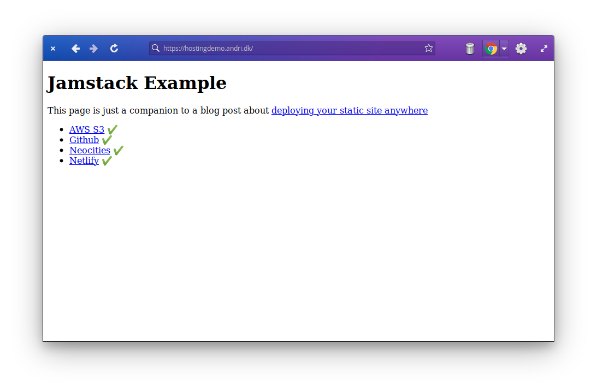

Hosting doesn't have to be complicated or expensive. I'll show you how to host a static site for $6/mo on DigitalOcean ([ref link](https://m.do.co/c/eb735821ebb8)).

Be warned, this is a bit technical and you will need to type some things into a terminal. I will explain what each line does on the way.

## Creating the server

Log on to the DigitalOcean [cloud console](https://cloud.digitalocean.com) and create a new Droplet.

- **Distribution**: Ubuntu LTS or Debian is fine
- **Plan**: Basic
- **Options**: AMD, $6/mo (1G ram, 20G SSD, 1TB bandwidth)
- **Datacenter**: Just pick the one closest to you.
- **Authentication**: Pick a password or use a public SSH key (i use SSH keys).
- **Hostname**: Something that helps you remember. Mine is called "hostingdemo"

DigitalOcean offers automatic backups for $9.60/mo and you can select that if you want, but in our case... we'll be building the site elsewhere and uploading it.



After a few seconds, you should see your server ready.

## Logging on to the server
Note the **IP address** field. Click it to copy the address. You need SSH. It should already be installed on your Linux, Mac or Windows machine.

In your terminal shell (open terminal og cmd).

```session
ssh root@your-droplet-ip-address
```

If you selected a password, you'll be prompted for that. If you selected an SSH key and that key is setup on your machine you're all logged in.

## Installing what we need
We'll be using [Caddy](https://caddyserver.com) for our web-server to use its' automatic TLS feature. Other options could be nginx or apache.

```session
# Install the web server
apt install -y debian-keyring debian-archive-keyring apt-transport-https
curl -1sLf 'https://dl.cloudsmith.io/public/caddy/stable/gpg.key' | sudo apt-key add -
curl -1sLf 'https://dl.cloudsmith.io/public/caddy/stable/debian.deb.txt' | sudo tee -a /etc/apt/sources.list.d/caddy-stable.list
apt update
apt install caddy
# Update your server, highly recommended
apt dist-upgrade -y
```

Now open a browser and access *http://your-droplet-ip-address*



That was easy, right?

## Adding a web user to upload with
So far, we've been using "root", a system user that can do anything. We don't want to spread that around. Create a new user:

```session
useradd webuser --password somethingstronger -s /sbin/nologin -m
```

This creates "webuser" with the password "somethingstronger" (and I do mean, it... use your own strong password), disables the SSH login and creates a home directory.

## Enabling SFTP
To be able to upload files from a non-privleged user we need to change the SSH configuration a bit. Open the SSH daemon config in "/etc/ssh/sshd_config".

```session
nano /etc/ssh/sshd_config
```

Make sure that the following lines look like this:

```
Subsystem       sftp    internal-sftp
PasswordAuthentication yes
```

The first one enables use of SFTP without having a login shell (like our limited webuser) and the second allows password logins for SSH.

Restart the SSH server
```session
service ssh restart
```

Test the login from your machine (this works on Mac and Linux, unsure about Windows)

```session
sftp webuser@your-droplet-ip
```

```
webuser@your-droplet-ip's password: 
Connected to your-droplet-ip.
sftp> 
```

## Tell Caddy to serve files from our webuser directory

```session
nano /etc/caddy/Caddyfile
```

```
:80

# Set this path to your site's directory.
root * /home/webuser

# Enable the static file server.
file_server

# Refer to the Caddy docs for more information:
# https://caddyserver.com/docs/caddyfile

```

This tells Caddy to serve from the webuser home directory instead. But, we need to give it access.

```session
usermod -a -G webuser caddy
service caddy restart
```

### Test the web-server

Upload an "index.html" to your server. Use whatever SFTP client you like (like FileZilla or winscp). From my local machine, I create a simple HTML file on my computer called "index.html" with "hello world" in it. Then I uploaded it to our server.

```
sftp sftp webuser@your-droplet-ip
put index.html
```


## Adding a hostname or a domain

I added a DNS record to give my server a name. How exactly you add this depends on your DNS hosting provider. DigitalOcean has this under "Networking -> Domains".

- **Hostname**: whateveryouwant (I used "hostingdemo")
- **Record Type**: A
- **Target**: your-droplet-ip-address

 
 
 Now, if I point a browser to http://hostingdemo.andri.dk...
 
 
 
 ## Adding Encryption (TLS/SSL)
 
 To do this, we open our Caddyfile again in "/etc/caddy/Caddyfile" and change it to the following:
 
```
hostingdemo.andri.dk # replace this with your hostname

# Set this path to your site's directory.
root * /home/webuser

# Enable the static file server.
file_server

# Refer to the Caddy docs for more information:
# https://caddyserver.com/docs/caddyfile

```

Reload the configuration.

```session
service caddy reload
```

Then in your browser change the URL from "http" to "https" and reload.


## Wrapping up

- We created a new server on DigitalOcean
- We added a new non-privileged user "webuser" and configured it to upload the site
- We setup a DNS name for our new site
- We setup Caddy with automatic TLS using [Lets Encrypt](https://letsencrypt.org)

## Bonus

### Automatically upload your Jamstack site with Github Actions
This is covered in more details in my [Deploy your Static Site Anywhere](https://andri.dk/blog/2021/deploy-static-websites-anywhere) post, but copy paste the following into a `.github/workflows/deploy.yaml` file in your repo on Github.

You need the following secrets set up on your repo:
- **SFTP_HOST**: host or ip of droplet
- **SFTP_USER**: webuser
- **SFTP_PASS**: yourverysecretpassword

```yaml
name: buildpack
on: [push, pull_request]
jobs:
  remote-build:
    runs-on: ubuntu-latest
    container:
      image: docker:stable
      volumes:
        - /home/runner:/workspace
    env:
      IMG_NAME: ${{ github.workflow }}
      NODE_ENV: production # Makes this a little more clean on the Node side
    steps:
      - name: Checkout
        uses: actions/checkout@v2
      - name: Login to GitHub Container Registry
        uses: docker/login-action@v1
        with:
          registry: ghcr.io
          username: ${{ github.repository_owner }}
          password: ${{ secrets.GITHUB_TOKEN }}

      # Downloads and caches the pack command (the code is open)
      - uses: andrioid/setup-pack@main
      # Attempt to fetch any previous image so that we may use it for caching
      - run: docker pull ghcr.io/${GITHUB_REPOSITORY}/${IMG_NAME} || true
      # Builds your site with buildpacks (heroku builder)
      - run: pack build ghcr.io/${GITHUB_REPOSITORY}/${IMG_NAME} --builder=heroku/buildpacks:20
      # Pushes your new image to Github's Container Registry
      - run: docker push ghcr.io/${GITHUB_REPOSITORY}/${IMG_NAME}
      # Copy the build assets from the container and cleanup
      - run: CONTAINER_ID=$(docker create ghcr.io/${GITHUB_REPOSITORY}/${IMG_NAME}:latest /bin/sh) && docker cp ${CONTAINER_ID}:/workspace/public . && docker rm ${CONTAINER_ID}
      - run: ls -alh public
      - uses: actions/upload-artifact@v2
        with:
          name: public
          path: public/

  deploy-via-sftp:
    needs: remote-build
    runs-on: ubuntu-latest
    env:
      RCLONE_CONFIG_VPS_TYPE: sftp
      RCLONE_CONFIG_VPS_HOST: ${{ secrets.SFTP_HOST }}
      RCLONE_CONFIG_VPS_USER: ${{ secrets.SFTP_USER }}
      RCLONE_CONFIG_VPS_PASS_PLAIN: ${{ secrets.SFTP_PASS }}
    steps:
      - uses: andrioid/setup-rclone-action@main
      - uses: actions/download-artifact@v2
        with:
          name: public
          path: public
      - run: echo "RCLONE_CONFIG_VPS_PASS=$(rclone obscure ${RCLONE_CONFIG_VPS_PASS_PLAIN})" >> $GITHUB_ENV
      - run: rclone -v copy public vps:.


```

This requires you to have a repository on Github and that your site can be built with Buildpacks. I have this running with Gatsby, but it should work with almost anything that builds into `public/`.



Now my Jamstack Example site is deployed on our VPS!


