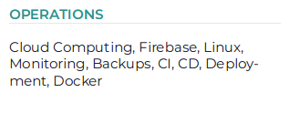
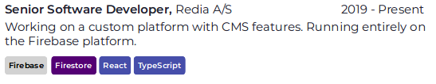

## TLDR;

- [See my CV](/cv.pdf)
- [See the code](https://github.com/andrioid/andri.dk/tree/master/src/cv)

## But why?

I never much cared for pixel-pushing on screen. It has always been a necessary evil. But, print? Love that shit. I did my university reports in LaTeX, even the graphics and even though the errors were HORRIBLE, it remained a loyal TeX fan.

So when I received a task at work to evaluate [react-pdf](https://react-pdf.org/) vs CSS-printing I knew I had something special to play with.

I wanted the following features:

- Use [JSON resume](https://jsonresume.org/schema/) for the CV data
- Components for for work-experience, education and sections
- Built automatically with my Gatsby site into a PDF file

## A good starting point

There is a an [example](https://github.com/diegomura/react-pdf/tree/master/examples/resume) in the react-pdf repo that has much prettier code then mine. So, if you want to make your own, I suggest you start there.

## Using JSON resume, well mostly

If you're anything like me, you don't like updating your CV, or portfolio. Or you just forget. We can use [one JSON file](https://github.com/andrioid/andri.dk/blob/master/src/cv/resume.json) for all those things and be done with it.

The spec is good, but I made some minor changes to mine. I added a "skills" array to work-item and "color" string to skill-items.

Visit [jsonresume.org](https://jsonresume.org) and make your own _resume.json_ file.

They even offer free hosting and rendering of your résumé, and if you're feeling lazy, then just do that instead.

## Components

I've pasted some code in here, so that you can get a little feeling for how this is built. But, keep in mind that the code might change, and refer to the repo for code-examples.

### Box

A simple box, with an headline.



```jsx
export const Box = ({ children, title, color, style = {} }) => (
  <View wrap={false} style={{ marginBottom: 20 }}>
    <SectionHeader color={color}>{title}</SectionHeader>
    <View style={{ ...style }}>
      {children && typeof children === "string" ? (
        <Text>{children}</Text>
      ) : (
        children
      )}
    </View>
  </View>
);
```

### Work Item



```jsx
export const TimelineItem = ({
  title,
  period,
  children,
  employer,
  tags = [],
  location,
}) => {
  tags = tags.sort();
  return (
    <View wrap={false} style={{ marginBottom: 10 }}>
      <View
        style={{
          flexDirection: "row",
          justifyContent: "space-between",
          marginBottom: 2.5,
          flexWrap: "wrap",
        }}
      >
        <Text style={{ fontWeight: "bold" }}>
          {title}, <Text style={{ fontWeight: "normal" }}>{employer}</Text>
        </Text>
        <Text>{period}</Text>
      </View>

      {children && <Text style={{ marginBottom: 2.5 }}>{children}</Text>}
      {tags && (
        <View style={{ flexDirection: "row" }}>
          {tags &&
            tags.map((m) => (
              <Tag key={m} color={tagColors[m.toLowerCase()]}>
                {m}
              </Tag>
            ))}
        </View>
      )}
    </View>
  );
};
```

## Build with Gatsby

Originally, I wanted Gatsby to render my CV as a page, using react-dom on the client and pdf on the server. That turned out to be very hard to do, with little gain. So now we just generate the PDF file seperately.

In retrospect, I should probably move this into pkg/cv instead of src/cv.

### package.json

```js
	"scripts": {
		"build-cv": "cd src/cv && babel-node build.js",
		"watch-cv": "cd src/cv && nodemon --exec babel-node build.js"
	},
```

### gatsby-config.js

```js
exports.onPostBuild = () => {
  const cp = require("child_process");
  cp.execSync("yarn run build-cv");
};
```

### src/cv/.babelrc

From the react-pdf repo. I also tried to adapt Gatsby's babel configuration here, but without luck.

```js
{
	"presets": [
		[
			"@babel/preset-env",
			{
				"loose": true,
				"targets": {
					"node": "current"
				}
			}
		],
		"@babel/preset-react"
	],
	"plugins": [
		"@babel/plugin-transform-runtime",
		"@babel/plugin-proposal-class-properties"
	]
}

```

### Workflow

Then just run `yarn run watch-cv` while developing it. I use evince on Linux as my PDF viewer, because it automatically reloads the file on-write. So almost like hot-reloading.

## Conclusion

This was a fun project for me. I'm not seeking employment, so I'm not motivated to polish it further at this time. I hope this gave a few bread-crumbs, if you're considering something similar.
