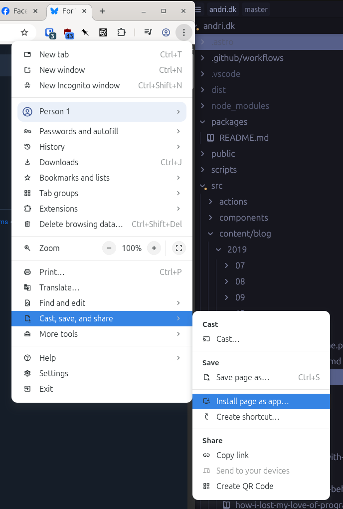

At work, we use Microsoft Teams, and we used to (and sort of still) use Slack. I recently switched from a Macbook Pro to a Linux laptop (again), and what annoys me greatly is that when I "share screen/application" in the Slack or Teams app it offers me only to share my entire monitor.

### Chrome can do it!

By accident, I stumbled upon that Slack running in Chrome on Linux can share windows just fine. The native Slack app does not. So I went on an adventure to figure out how to add web-apps to the Linux desktop and it's surprisingly hard to find (hence this post).

As of 2025, this option is in "Menu -> Cast, Save & Share -> Install".



Just navigate to the site you want to open as an application, click "Create Shortcut" from the menu, check "Open as Window" and you're good.

On Linux, this will create a `.desktop` file in `~/.local/share/applications` so that your desktop environment will pick it up. This guide should also work fine on Windows and Mac.

Note, that if you have Chrome installed via Flatpak, [it might not have permissions](https://discourse.flathub.org/t/pwas-this-flatpak-does-not-have-write-access-to/3830/1) to save the `.desktop` files. Use a tool like [Flatseal](https://flathub.org/en/apps/com.github.tchx84.Flatseal) to add `~/.local/share/applications` and `~/.local/share/icons` to filesystem permissions.

### Plus, it's better!

Today, I'm running Outlook, Slack and Teams as progressive-web-applications and the performance is much better, screen/window sharing works and it uses less CPU than the Electron apps.

### Desktop files

The application definition file looks something like this. You can technically create those yourself. Just make sure that the IDs are fresh.

```
#!/usr/bin/env xdg-open
[Desktop Entry]
Version=1.0
Terminal=false
Type=Application
Name=andri.dk | Andri Óskarsson
Exec=flatpak 'run' '--command=/app/bin/chrome' 'com.google.Chrome' '--profile-directory=Default' '--app-id=mciljpmicooimcedlcgapdnklfobboeb'
Icon=chrome-mciljpmicooimcedlcgapdnklfobboeb-Default
StartupWMClass=crx_mciljpmicooimcedlcgapdnklfobboeb
X-Flatpak-Part-Of=com.google.Chrome
TryExec=/var/lib/flatpak/exports/bin/com.google.Chrome
```
