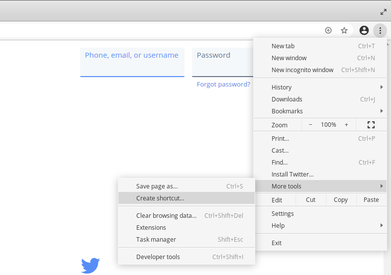

At work, we use Microsoft Teams, and we used to (and sort of still) use Slack. I recently switched from a Macbook Pro to a Linux laptop (again), and what annoys me greatly is that when I "share screen/application" in the Slack or Teams app it offers me only to share my entire monitor.

### Chrome can do it!

By accident, I stumbled upon that Slack running in Chrome on Linux can share windows just fine. The native Slack app does not. So I went on an adventure to figure out how to add web-apps to the Linux desktop and it's surprisingly hard to find (hence this post).

As of 2025, this option is in "Menu -> Cast, Save & Share -> Install".

Just navigate to the site you want to open as an application, click "Create Shortcut" from the menu, check "Open as Window" and you're good.

On Linux, this will create a `.desktop` file in `~/.local/applications` so that your desktop environment will pick it up. This guide should also work fine on Windows and Mac.

### Plus, it's better!

Today, I'm running Outlook, Slack and Teams as progressive-web-applications and the performance is much better, screen/window sharing works and it uses less CPU than the Electron apps.
