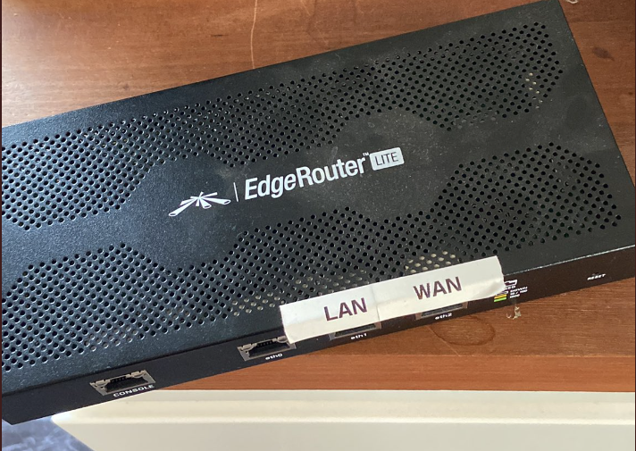
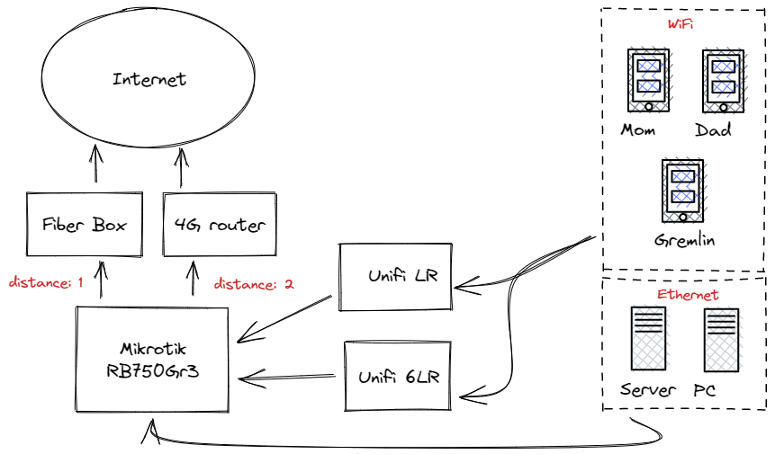
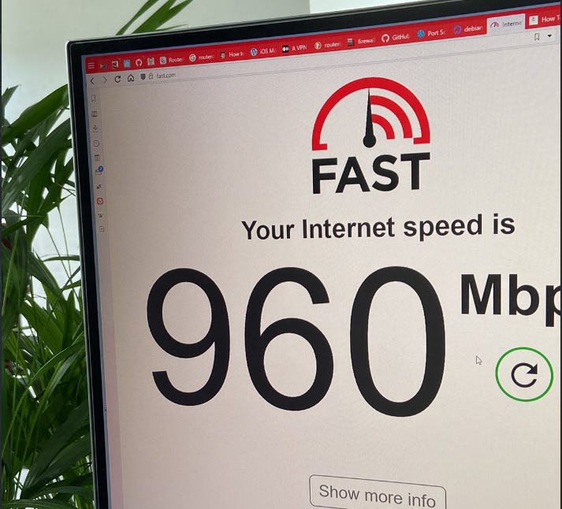

Our home-network has been running on an Edgerouter Lite (now discontinued) for 8 years or so and it worked just fine. But, during the summer the heat in our garage has been exceeding 30C/86F degrees and it gave up on me. Now it peeps like a little bird when I turn it on.

### Finding a replacement

So, I used to install Cisco equipment in another lifetime so I have a deep hatred for routers that attempt to do both WiFi and wired Internet. My router should route stuff, act as a firewall and _maybe_ provide basic network services.

Requirements:

- No WiFi
- Have at least 3 gigabit ethernet ports
- Run something that doesn't have a horrible [security track record](https://www.cvedetails.com/vulnerability-list.php?vendor_id=12508&product_id=23641)
- Allow me to manually manage stuff like firewall rules/interface settings/routing

A friend from work recommended [Mikrotik](https://mikrotik.com) and while I wasn't terribly thrilled about the WiFi access-point I bought from them, I decided to give it a shot.

I settled on the [Mikrotik](https://mikrotik.com/product/RB750Gr3). They publish throughput test results on their page and I really like that. Usually vendors try to hide stuff like that. But, given that I have a 1 gigabit connection to my house and it can throughput around 1.972 Mbps it sounded perfect.

### The plan

Now that I had my router (props to [Proshop](https://www.proshop.dk) for shipping it within 12 hours) I had an opportunity to plan the network a little better.

### Conclusion

- I'm very happy with the whole setup, except the cable-mess I spawned in our technical cabinet
- Should the fiber fail, it will automatically route all the traffic through 4G (around 100mbit/s)
- Automatically assigns a hostname to the external addres (regardless of fiber/4g)
- VPN from my phone with Wireguard so I can access Home Assistant from wherever without exposing any services to the Internet

Tell me about your network setup?
