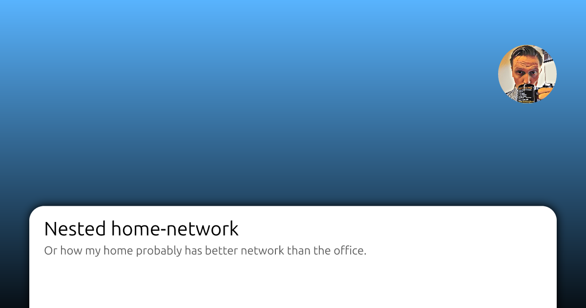

Posts that have social-cards, or og-image attached get more views, and they look much better when shared.

I'm creating a tool called [md-social](https://github.com/andrioid/md-social) that was originally meant for posting my posts on Bluesky automatically, and registering the the post-id back in the markdown. But, I've since extended it to also generate social-cards too. I know of other tools in this area, but I think it's ridicilous to use a full complete browser to rasterize an SVG file.

### Wait, haven't you created stuff like this before?

Yes, I've previously created plugins for Gatsby, and hacked something together for Astro too. But, I wasn't quite happy with it.

### How does it work?

md-social scans a directory of markdown files and uses SVG, Go templates and resvg to generate og-images for each post. The background and author images can be customized via ENV variables.

```bash
# My configuration (secrets injected by GitHub workflow)
BLUESKY_HANDLE: ${{ secrets.BLUESKY_HANDLE }}
BLUESKY_APP_PASSWORD: ${{ secrets.BLUESKY_APP_PASSWORD }}
MD_BASE_URL: https://andri.dk/blog
PUBLISH_MAX_DAYS: 7
VERBOSE: 1
BASE_URL: https://andri.dk/blog
OG_IMAGE_BG: public/img/gradient.svg
OG_IMAGE_AUTHOR: public/img/coffee-art.jpg
OG_DEST_DIR: public/img/social
```

If you don't set the Bluesky stuff, then it will skip it.

The tool can be configured with flags, or environment variables and is [available on NPM too](https://www.npmjs.com/package/@andrioid/md-social).



### Using the images
I'm using it with Astro, in my `<Layout />` components. The path to the og-image is relative to the markdown file, so if you're blog-post is in "src/content/blog/2025/moo.md", and you set a og-dest-dir of "public/img/social", then it will create an image in "public/img/social/2025/moo.png" for you.

```astro
{ogImage && (
<meta property="og:image" content={`${ogImage}`} />
<meta name="twitter:card" content="summary_large_image" />
<meta name="twitter:image" content={`${ogImage}`} />
)}
```

### But, I'm not using Astro!
The reason why I built this tool, is that I've been blogging (somewhat) for years. I sometimes change framworks, but I keep the markdown files. So, this tool should work just fine with Hugo, Jekyll or any static site generator.

### Future vision
The tool can already post to Bluesky, attach the post-id and generate open-graph images for me. But, I'm considering extending it some more:

- Descriptions via OpenAI tokens could be cool
- More og-image templates, or even custom ones
- Generate cover images from tags or content somehow
- Taxonomy of some kind

Please check it out and let me know what you think.