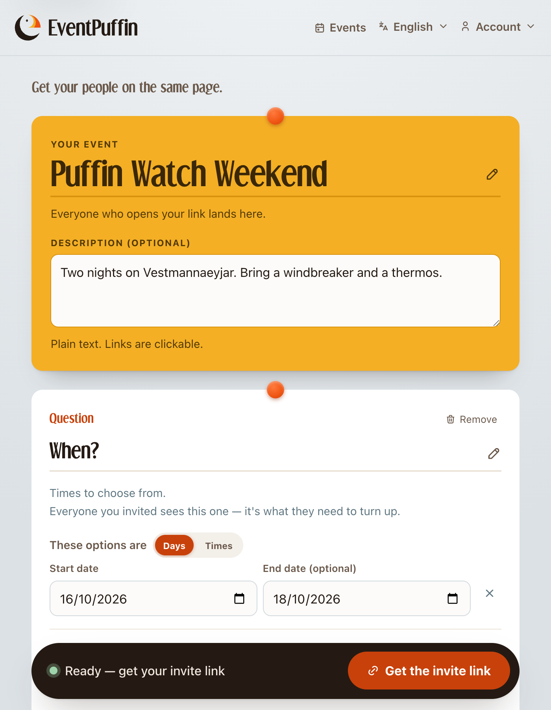
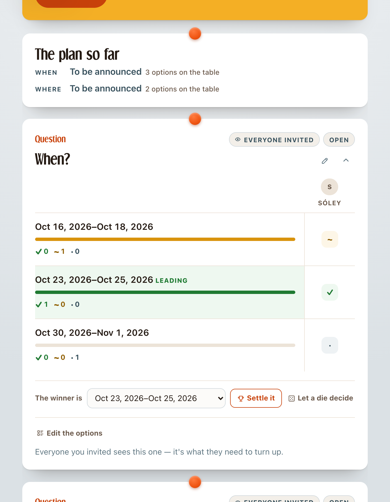
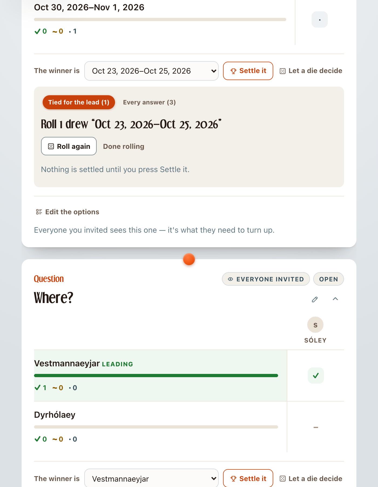
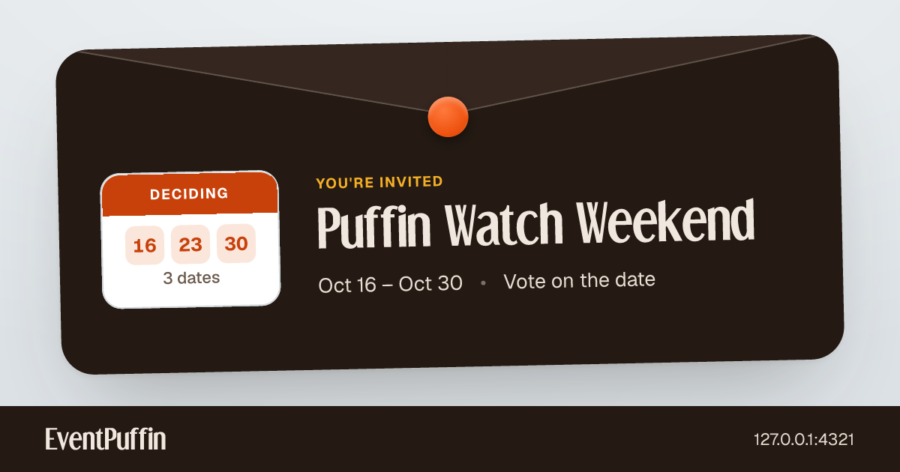
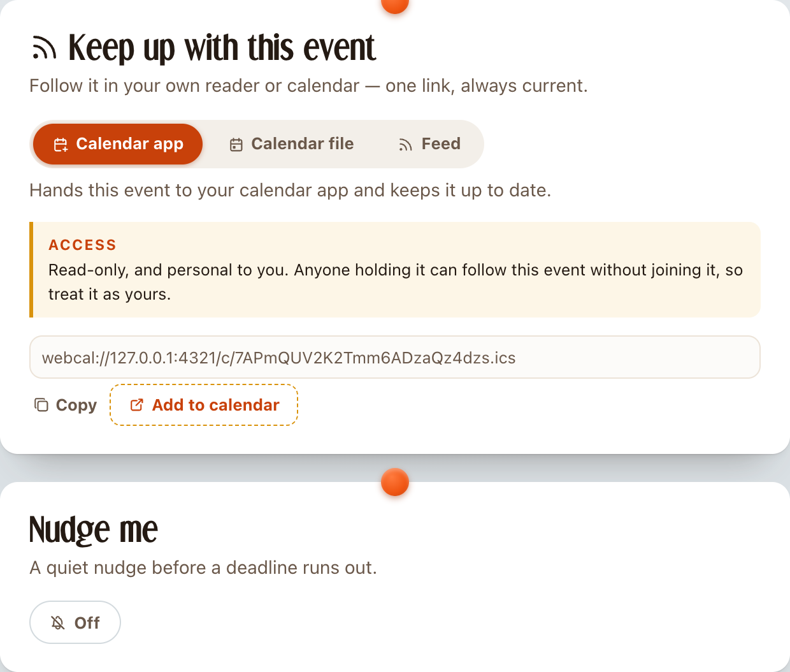

[EventPuffin](https://eventpuffin.com) is an event-planning platform that makes it easy to coordinate with multiple people and invite guests.

## Problem domain

Occasionally, I have to plan birthdays, trips or other social events with friends, family and sometimes work. The current landscape of planning events involves horrible platforms that lock you in, spam you and/or fill your screen with ads.

Sometimes it's simple and you can decide yourself, but sometimes you have to find a date that fits most people, or settle on a film most people want to see, etc. That's where people used to reach for Doodle - except you'd have to create multiple Doodles for multiple polls.

Then you need to know who's coming. Most people might have Facebook, so you have to create the event there. But, then there are people who are not on Facebook and don't want an account. Then you'd have to text or email them individually.

## Vision
I want everyone to be able to participate in my events, regardless of what platforms they live on. It should be easy and self-explanatory to help decide, or RSVP. Grandma should be able to do it!

It's built for planning birthdays, trips to the cinema, a D&D campaign at a sommerhouse or your next meetup.

## Walkthrough

### Create an event
With EventPuffin everyone can create an event. You don't need an account - although if you'd like to log in on other devices, it's recommended.

### Make a decision, or loop in others
The most common details like _where_ and _when_ are already suggested. But you can ask whatever you want, like which pizza toppings people would like or what board games to play in the summer house.

You decide who gets a vote. One link for _deciders_ (votes, rsvp) and another link for _guests_ (only rsvp).

### Settle the poll, or roll the dice

After a while, it's time to make a decision. Then you can look at the answers, pick the obvious winner, decide yourself or roll the dice. You can also set a deadline for voting so that the poll closes itself automatically.

### Invite guests

You can invite guests at any time. Sometimes it's good to send invites early, to reserve date and figure out the details later. You can control which details the guests can see - but you can always start with the RSVP.

### Stay up to date, without spam

You and your people can follow along with live calendar links, RSS feeds or web notifications.

## Questions

### Why is it not a native app?
It's about barrier of entry. Both for us, but also for planners, deciders and guests. The app is made responsive, so it should work on any device.

### Why log in with atproto?
Where other platforms are hungry for your private data, we'd like to avoid storing it. Even an email address is personally identifiable and subject to privacy laws. We'd like to help you do what you want, and move on with your life.

There's also another reason for using [atproto](https://atproto.com). If you have an account and  _publish_ your event. We'll create a special calendar record on your atproto account which makes it visible on all supported platforms like [atmo.rsvp](https://atmo.rsvp). If you choose to _unpublish_ your event, we'll delete the record for you again.

## Special thanks
To my wife talented wife _Louise_ for designing the logo, lending me her good taste and for putting up with me for so long. _Mads_, _Jens_, _Ryan_, _Stefan_ and _Ulrik_ who kept asking about the project until one of the prototypes made it into production.
