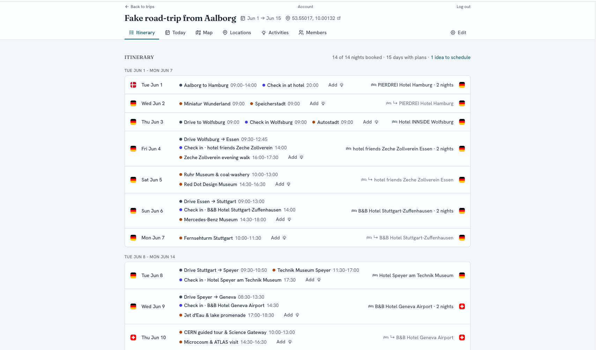
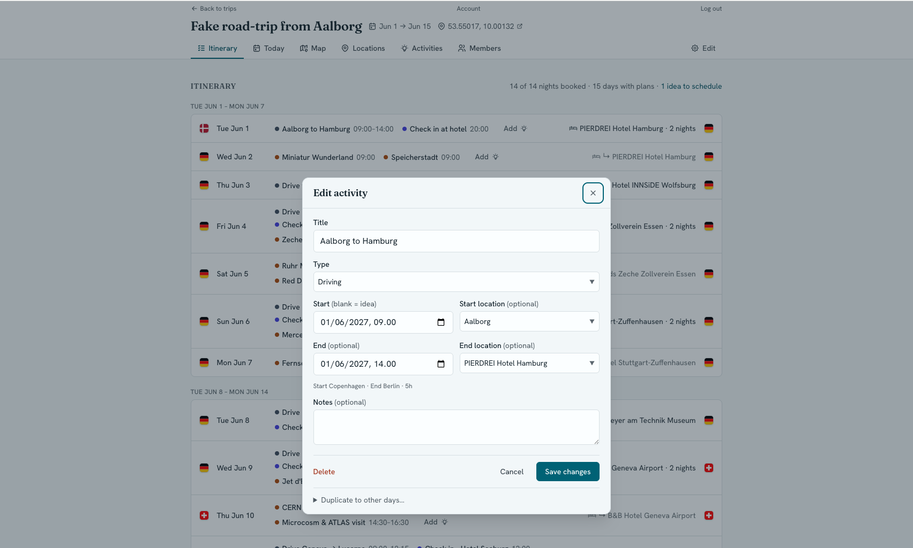
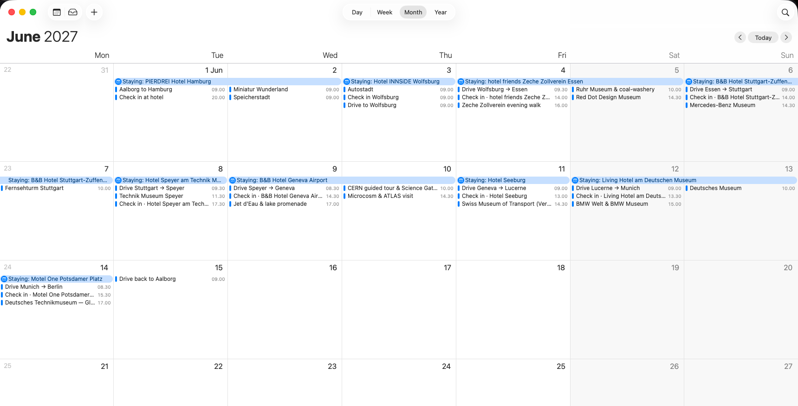
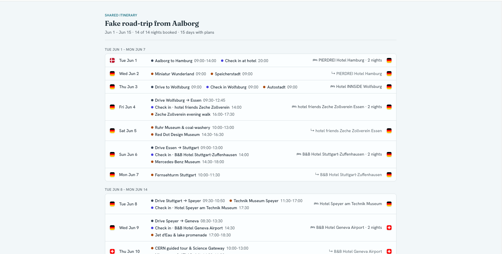
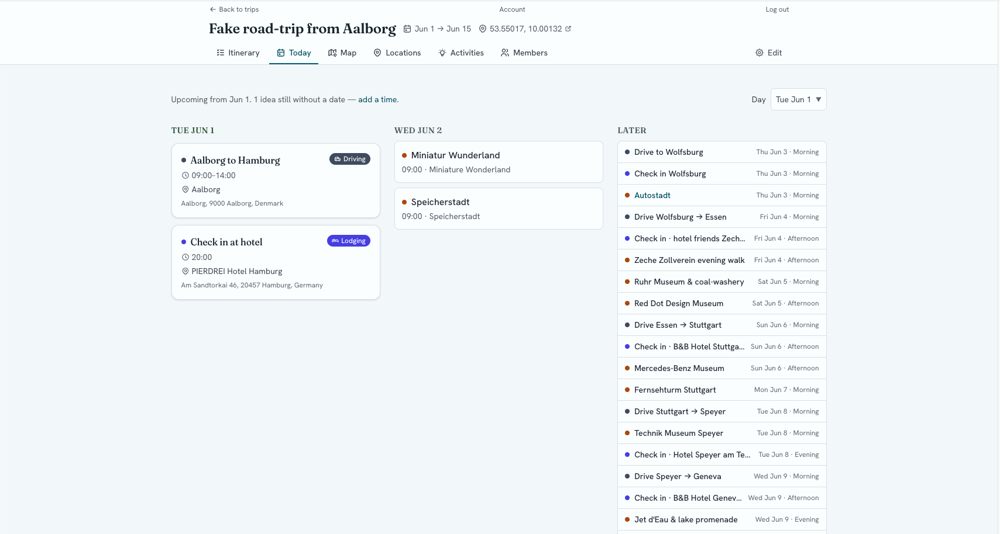
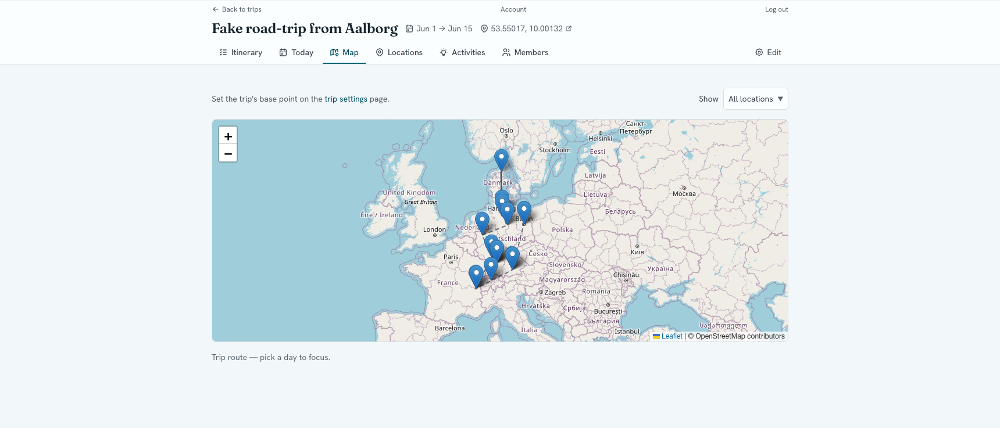
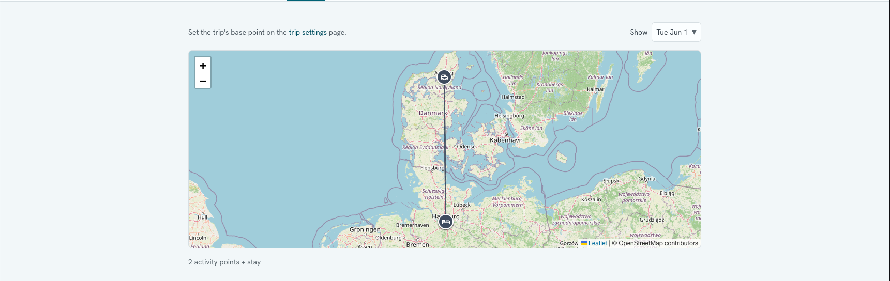
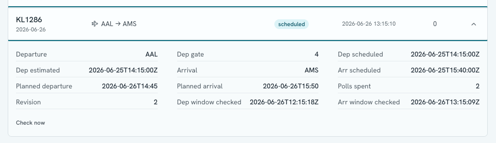
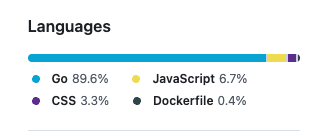

I am of two brains. I need structure, but I hate planning. We had decided to stay in Iceland for a few weeks while visiting family and attending family gatherings. But, that left a lot of empty columns in the calendar, and people asking me if we have any plans. I shrugged and asked if they had any ideas.

As time kept creeping in on me, I eventually decided that I should try to put _some_ plan together. But, that sounded very boring - so I decided to create software to help me (reads yak-shaving).

## The itch worth scratching

Every time we go on vacation there are a few dominating things that shape the rest of the trip. Our method of **transportation** and where we are **sleeping**. Then there are things we'd like to do, and the rest **must** be flexible for any chance of relaxation.

## Itinerary

The pillars of our plan; accomidation and sleeping. Easily set from the first page. Both can span one or more days.

## Places and Activities

It was important that this was structured, but not so structured that we'd hate using it. An _activity_ can be anything (eating, partying, driving, flying) and each activity needs a _location_. Locations can be added via address, or pinning it on a map.

## Here is where I should've stopped

For all intents and purposes, the tool was now complete. We could look at the itinerary and plan our vacation accordingly.

But, I kept going....

### Syncing with our calendar

The tool generates a webcal subscription that can be copied into Google/Apple/etc calendars and it automatically updates as you iterate on your plan.

### Read-only share link

I wanted to be able to show my family _the plan_ without teaching them about my over-engineered tool, so it's possible to copy/paste a secret link and send it to them so they can see what the plan is.

### Day-view (Today)

I wanted an overview that could tell we what we're doing today, tomorrow and not stress me out on any future details.

### Map for all days, each day

Sometimes it's fun to visualize where you're going and see it on a map.

You can also zoom in on each day.

### We're flying. Why not track flights?

I'd share a screenshot here, but I've already stretched the limits of my free [AviationStack](https://aviationstack.com) account. Their free tier has 100 lookups per month. Plenty for a single-user trip-platform, right?

In a "flying" activity, you can supply an optional IATA flight number and it will pull flight data 30m before departure and arrival. Then it will update the page with flight information (gate, delays, etc) and your calendar too!

Below is a screenshot of a test-flight from yesterday

### Single-user? Why not multiple users

Today, I decided to add _users_ to the platform. If you'd like to play with my little tool you can find it at [trip.andri.dk](https://trip.andri.dk). You'll need a passkey to create an account. Passwords are so 2025!

## That's all

This was a surprisingly fun project. But, I still haven't planned our summer vacation yet. So, I should probably go do that now. Bye!

## Still here?

I might was well put a few words on how this was made. With a scope like this, it should be pretty obvious that this was either done over multiple weeks/months, or assisted by AI.

### What separates the vibe-coders from the agentic engineers?

Planning! Not the boring kind, like vacations. Code planning. I spent over half a day iterating on requirements, user-stories and implementation details before allowing allowing the AI to write any code.

### Tech Stack

I went with a server-rendered Go application using [Gastro](https://gastro.andri.dk). If you don't use your own framework, then who will? It also has [Datastar](https://data-star.dev), web-components and some minor JavaScript.

All behaviours have test-cases, and are usually implemented as http tests. I had the AI use a headless browser while implementing to test interactivity.

Database is [SQLite](https://sqlite.org) and I'm using [sqlc](https://sqlc.dev) to generate type-safe ORM-like functions from the schema. Migrations are managed by [Goose](https://github.com/pressly/goose).

### Conclusion

I'm pretty happy with how this turned out, and the code is surprisingly readable. Most importantly, there is absolutely no browser state/side-effects to spoil my day. Yet the application feels quite dynamic.

I would like to lean more into Datastar SSE patching and signals at some point. But, for now it's mostly just templates and form submittions.

Could I have written this by hand? Sure! But, it would've taken much longer and had less coverage. Besides, this is a low-stakes personal project that scratches an itch. I also used the frictions from this project, to improve Gastro.
